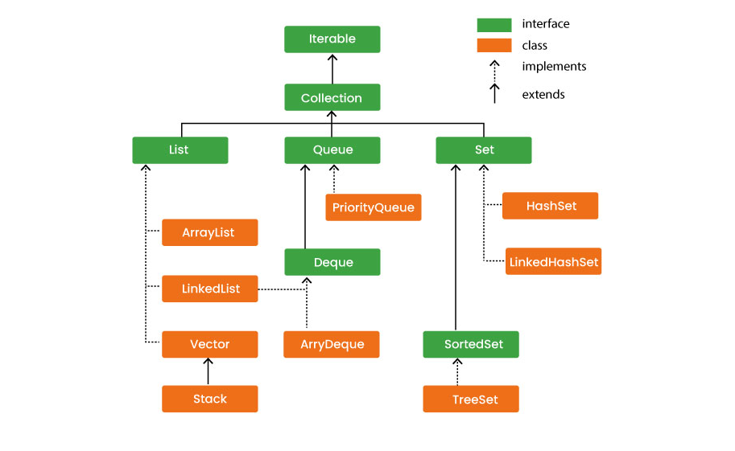

# About repository

In this project, I store my notes about data structures and algorithms. Maybe it will help someone someday.

All the examples in this project are basic implementations only.

[Notes about datastructers and algorithms](https://legend-language-d6b.notion.site/Data-structures-12d2d487a1cc80c3b26aedfe08c118bd).

# Java collection framework
